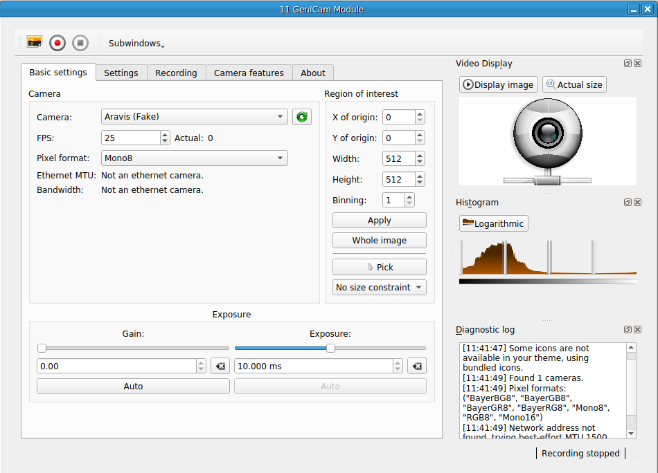

### GenICam Module

**Requirements:** intltool, libgstreamer1.0-dev, libgtk-3-dev, gtk-doc-tools,
libnotify-dev, libgstreamer-plugins-base1.0-dev, libgirepository1.0-dev,
libgstreamer0.10-dev, libgstreamer-plugins-base0.10-dev, python-gobject-dev,
python-gst0.10-dev, python-gst-1.0, gobject-introspection, net-tools
**Limitations:**  



Module for controlling cameras that the use the open GenICam standard.
Currently a work in progress. Will include: 

- [x] Video/image capture
- [x] Events to trigger capture from other modules
- [x] Camera controls (setting gain, exposure time, etc.)
- [ ] Support loadable plugins for image processing

To install the module, you need to install Aravis and QArv.  Aravis is a GNU
Project-supported set of drivers for streaming images from GeniICam cameras.
QArv is a Qt wrapper for Aravis functions that we used to create the RTXI
module.  This module comes packaged with some scripts to install the needed
dependencies.  Run: 

``` 
cd scripts/ ./install_aravis.sh ./install_qarv.sh 
```

Once the packages are installed, build the module.  From the base of the
repository, run: ``` make sudo make install ```

**For ethernet cameras:** For the module to detect the camera, you need to set
its IP address.  Open the NetworkManager connection editor
(`nm-connection-editor`) and create a new ethernet connection. 

Hit "Add" to open the connection creation dialog, pick "Ethernet," and hit
"Create." Another dialog box will open up.  Under the "Etheret" tab (the one it
opens first), set the device MAC address from the dropdown menu.  You'll need to
know beforehand which device interface name (i.e., `eth0`, `eth1`, etc.)
corresponds to your camera.  (Run `sudo ifconfig` in another terminal to see
what interfaces exist.) Once the MAC address is set, set the MTU to 9000. 

Next, switch to the "IPv4 Settings" tab, and set the IP address for the camera.
Under "Method," pick "Manual." Under "Addresses," you can set the address to
more-or-less whatever you want. For example: 

	Address: 169.251.1.1 
	Netmask: 255.255.0.0 
	Gateway: 169.254.255.255

You don't need to configure anything else in this tab.  Hit "Save...", and
you're done. 


To open a camera within RTXI, load the module and pick it from the dropdown
menu.  If you just installed the module, the first detected camera will be
"Aravis Fake." Switch to you own camera via the dropdown menu. 


Based almost entirely on [qarv](https://github.com/AD-Vega/qarv). 
